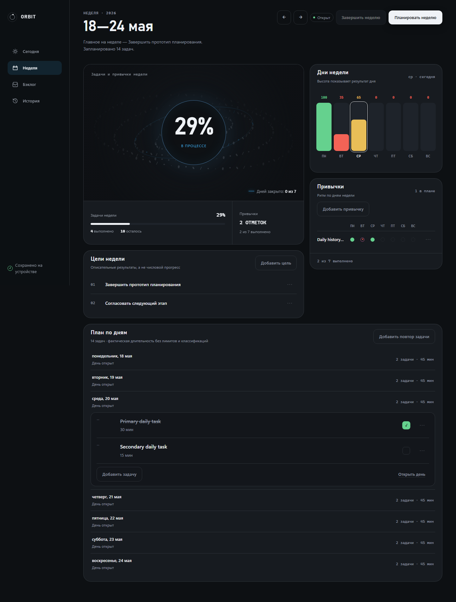
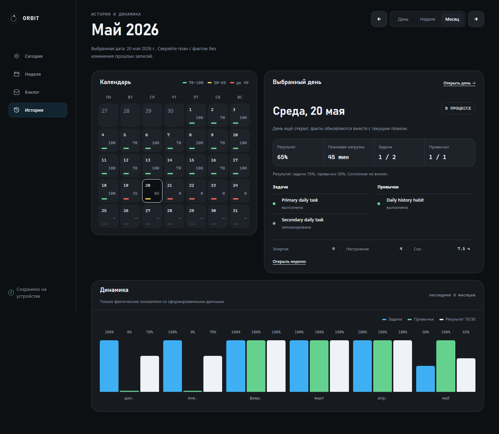
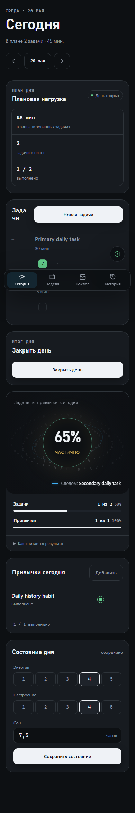

# ORBIT — личный цикл планирования

[](https://github.com/oia2/ORBIT/actions/workflows/ci.yml)
[](LICENSE)

Приложение для одного человека, построенное вокруг цикла
**план → выполнение → фиксация → обзор → корректировка**.

ORBIT намеренно узкий: он не пытается быть трекером привычек, таск-менеджером и
дневником одновременно. Он отвечает на один вопрос — _что я планировал, что из
этого произошло на самом деле, и что я меняю дальше_ — и отказывается
подменять факты догадками.

Интерфейс на русском. Данные хранятся на сервере ORBIT в PostgreSQL — это
единственный источник данных, поэтому они не привязаны к одному браузеру.


## Что он делает

- **Неделя** — фиксированные календарные недели с понедельника по воскресенье.
  Описательные цели недели без выдуманного «процента выполнения».
- **День** — задачи с длительностью и необязательным временем начала/окончания,
  привычки, состояние дня (энергия, настроение, сон).
- **Закрытие дня** — явное. Для каждой незавершённой задачи вы выбираете, что с
  ней произошло: оставить незавершённой, перенести на дату, отправить в бэклог
  или отменить. Ничего не переносится молча. После закрытия день неизменяем.
- **Повторы** — повторяющиеся задачи и привычки. Правка одного вхождения не
  трогает серию, изменение правила не переписывает прошлое.
- **Результат** — 70% задачи, 30% привычки. Состояние дня в расчёт не входит.
- **История** — только для чтения: день, неделя, месяц с фактами и динамикой.



### Чего в нём нет — и это осознанно

Нет аккаунтов и нет синхронизации между устройствами: данные централизованы на
одном сервере, а не реплицируются и не сливаются между копиями. Нет офлайн-режима,
очередей повторов и живых обновлений. Нет настраиваемой
«ёмкости дня», автоматического вывода о перегрузе и предупреждений о нагрузке —
показывается только фактическая сумма длительностей. Нет частичных исходов у
задач и привычек. Нет тренировок. Нет оценочных формулировок в адрес
пользователя.



## Разработка по SDD

Проект целиком ведётся в методологии **Spec-Driven Development** на
[GitHub Spec Kit](https://github.com/github/spec-kit). Спецификация здесь —
источник истины, а не документация, написанная задним числом: код появляется
после того, как поведение зафиксировано и решение принято явно.

Порядок работы:

```
/speckit-constitution → /speckit-specify → /speckit-plan
      → /speckit-tasks → /speckit-implement → /speckit-converge
```

Где что лежит:

| Артефакт                                           | Назначение                                                          |
| -------------------------------------------------- | ------------------------------------------------------------------- |
| `.specify/memory/constitution.md`                  | Пять принципов проекта. Имеют приоритет над всем остальным          |
| `specs/001-personal-planning-loop/spec.md`         | Требования FR-001…FR-059, критерии SC-001…SC-015, journal уточнений |
| `specs/001-personal-planning-loop/plan.md`         | Стек, архитектурные решения, границы                                |
| `specs/001-personal-planning-loop/data-model.md`   | Сущности и их поля                                                  |
| `specs/001-personal-planning-loop/contracts/`      | Доменные команды, персистентность, маршруты                         |
| `specs/001-personal-planning-loop/tasks.md`        | Задачи T001…T114 по фазам                                           |
| `specs/001-personal-planning-loop/traceability.md` | Каждое требование → проходящая проверка                             |

Два практических следствия, которые видны в истории проекта:

1. **Продуктовые изменения сначала попадают в спеку.** Когда по ходу
   ремедиации понадобилось добавить задачам время (FR-015a), убрать у привычек
   даты (правка FR-015) или вернуть текстовые статусы результата (правка
   FR-034) — каждое решение записано в разделе Clarifications с датой сессии, а
   уже потом реализовано.
2. **Проверки нельзя закрыть «на честном слове».** Замена утверждённых
   визуальных эталонов защищена явным флагом одобрения, а задачи, требовавшие
   реальных устройств и живого участника (T107, T108), не были помечены
   выполненными — они удалены решением владельца продукта, и последствия
   записаны в `traceability.md` в разделе «Explicitly not evidenced».

## Стек

| Слой             | Выбор                                                            |
| ---------------- | ---------------------------------------------------------------- |
| UI               | React 19.2 + TypeScript 6 (strict)                               |
| Сервер           | Fastify 5 на Node.js 22                                          |
| Сборка           | Vite 8.1                                                         |
| Маршрутизация    | React Router 8.3                                                 |
| Хранилище        | PostgreSQL 17 через Kysely + `pg` — единственный источник данных |
| Архитектура      | Feature-Sliced Design                                            |
| Юнит-тесты       | Vitest 4 (node + jsdom проекты), V8 coverage                     |
| E2E и визуальные | Playwright 1.62                                                  |
| Качество         | ESLint 9 (type-aware, FSD-правила), Prettier 3                   |

Runtime-зависимости: `react`, `react-dom`, `react-router` на клиенте и
`fastify`, `@fastify/static`, `kysely`, `pg` на сервере. Нет стейт-менеджера,
ORM, query-кэша и HTTP-клиента — они не понадобились: браузерный адаптер
репозитория пересылает вызовы как есть, без кэша, очереди и повторов.

Требуются **Node.js 22.22+** и **Docker с Compose v2**.

### Структура

```
src/
  app/        провайдеры, роутинг, оболочка, стили и рантайм
  pages/      week · day · backlog · history · not-found
  features/   manage-week · manage-task · manage-habit
              record-daily-state · close-day · complete-week
  entities/   planning — model (чистый домен) + api (HTTP-адаптер) + ui
  shared/     lib (даты, id, result, длительности) и ui-примитивы

server/
  api/        маршруты, разборщики запросов, часы запроса
  planning/   PostgresPlanningRepository — реализация того же порта
  db/         схема Kysely, клиент `pg`, миграции
```

Границы, которые проверяются линтером и тестами: React никогда не видит схему
базы, сервер никогда не импортирует клиентские слои, а чистый домен не
импортирует React, роутер, DOM, Node или драйвер базы. Всё взаимодействие идёт
через порт `PlanningRepository` — его реализуют дважды: `PostgresPlanningRepository`
на сервере и тонкий `HttpPlanningRepository` в браузере.

## Запуск

Всё приложение одной командой:

```bash
docker compose up    # http://localhost:3000
```

Один источник отдаёт и интерфейс, и `/api`. Миграции применяются при старте
сервера, поэтому первый запуск на пустом томе даёт рабочий пустой ORBIT.

Обе службы объявлены с `restart: unless-stopped`, поэтому после перезапуска
демона Docker контейнеры поднимаются сами — если только вы не остановили их
явно (`docker compose stop` или `down`). Чтобы это происходило и после
перезагрузки компьютера, нужно включить автозапуск самого Docker Desktop:
**Settings → General → «Start Docker Desktop when you sign in»**. Это
пользовательская настройка Windows, репозиторий её задать не может.

Для разработки — база в Docker, клиент и сервер на хосте:

```bash
docker compose up -d db   # PostgreSQL на именованном томе orbit-db-data
npm install
npm run dev:server        # Fastify на :3000
npm run dev               # Vite на :5173, проксирует /api на :3000
```

Клиент всегда обращается по относительному пути `/api`, поэтому базового URL
API нигде настраивать не нужно.

### Обновление версии

**Никогда не используйте `docker compose down -v`.** Флаг `-v` удаляет том
`orbit-db-data` вместе со всеми записями. Именно так база обнулилась 18 августа
2026 года.

Безопасная последовательность:

```bash
npm run db:backup                   # обязательный шаг: дамп в backups/
docker compose up -d --build        # пересобирает app, том остаётся на месте
docker compose logs app | tail -30  # миграции должны примениться до первого запроса
```

Сервер применяет миграции при старте, поэтому дамп нужно снять **до** сборки.
Откат, если что-то пошло не так:

```bash
npm run db:restore -- backups/<файл>.dump
```

`docker compose down` без `-v` безопасен всегда: он останавливает контейнеры и
сохраняет том.

Проверки:

```bash
npm run verify       # format + lint + typecheck + server + coverage + e2e
```

Отдельно:

```bash
npm run test         # домен и UI, база не нужна
npm run test:server  # репозиторий и транспорт, нужна PostgreSQL
npm run test:server:tz  # то же в не-UTC зоне (SC-007)
npm run test:coverage
npm run test:e2e     # сборка + Playwright
npm run test:visual  # только визуальные сравнения
npm run lint
npm run typecheck
npm run build
npm run db:migrate   # применить миграции вручную
```

**Docker — обязательное условие для `verify`, `test:server`, `test:server:tz`
и `test:e2e`.** Сначала поднимите базу: `docker compose up -d db`. Серверные
тесты идут против настоящей PostgreSQL, потому что ограничения схемы —
часть того, что доказывает корректность; на подменённом движке они остались бы
непроверенными.

## Тестирование

`npm run verify` проходит целиком:

- **603 юнит-теста**, покрытие 86.4% инструкций и 81.54% ветвей при порогах
  85/80; для доменных политик порог выше — 95%. Из них 199 — серверные, против
  настоящей PostgreSQL.
- **67 Playwright-тестов** в четырёх проектах: клавиатурный Chromium 1440,
  тач-WebKit 820 и 390, и визуальные сравнения.
- Семь сквозных сценариев на каждый пользовательский сюжет, плюс проверки
  переполнения на 360–1920, axe-сканы, работа после перезагрузки, видимость
  тех же данных из другого браузера и честное поведение при недоступном
  сервере.
- Девять наборов тестов репозитория из feature 001 перенесены на PostgreSQL
  без правки доменных утверждений — это и есть доказательство, что поведение
  не изменилось. Что именно было заменено, перечислено в
  `specs/002-server-backed-persistence/traceability.md`.

Даты в сценариях вычисляются во время прогона, а не зашиты в код — иначе тесты
начинают падать просто оттого, что прошла неделя.

Те же гейты выполняет GitHub Actions на каждый push в `master` и каждый
pull request — тремя задачами: `format + lint + typecheck`, `unit + server`
против сервиса PostgreSQL 17 и `e2e` на Playwright. Конфигурация —
`.github/workflows/ci.yml`. Визуальные сравнения в CI не входят, почему —
ниже, в разделе «Визуальный источник».



## Ограничения

Про них лучше знать заранее:

- Данные живут в PostgreSQL и не привязаны к браузеру: тот же план виден из
  другого браузера и переживает полную очистку данных сайта. Взамен ORBIT
  требует работающего сервера — офлайн-режима, очереди и синхронизации нет.
  Недоступный сервер показывается как ошибка: несохранённое изменение никогда
  не выдаётся за сохранённое.
- Развёртывание рассчитано на одного владельца: аккаунтов, входа и разделения
  данных между пользователями нет.
- `docker compose down` данные сохраняет — они на именованном томе
  `orbit-db-data`. Удаляет их только `docker compose down -v`, поэтому этот
  флаг не входит ни в одну штатную процедуру: обновление версии описано выше и
  начинается с `npm run db:backup`.
- Закрытый день можно открыть заново и снова редактировать. Если его неделя уже
  завершена, ORBIT откажет с объяснением; переоткрытие завершённой недели пока
  не поддерживается.
- **Нет проверки на реальных устройствах со скринридером** и **нет измеренного
  времени выполнения сценариев живым пользователем.** Соответствующие задачи
  были удалены из плана решением владельца продукта. Автоматические заменители
  работают (тач-сценарии, reflow, axe, reduced-motion, статусы без опоры на
  цвет), но временные критерии SC-001, SC-002, SC-003 и SC-010 остаются
  неподтверждёнными. Подробности — в `traceability.md`.

## Визуальный источник

Интерфейс сверяется с прототипами Open Design, замороженная копия которых лежит
в `specs/001-personal-planning-loop/visual-reference/` вместе с хешами и
манифестом. Приоритет при конфликте: конституция → `spec.md` →
`contracts/ui-routes.md` → `DESIGN.md` → прототипы. Прототипы содержат раздел
тренировок, которого в MVP нет намеренно.

Скриншоты в этом файле — утверждённые визуальные эталоны из
`e2e/visual/__screenshots__/`, то есть ровно то, что сравнивает
`npm run test:visual`.

Эталоны не содержат суффикса платформы, поэтому они действительны для
машины, которая их утвердила. Сравнение остаётся локальным шагом и в CI не
входит: перерисовка на чужом рендерере растровых шрифтов дала бы расхождение
там, где дизайн не менялся.

## Лицензия

MIT — см. [LICENSE](LICENSE).
