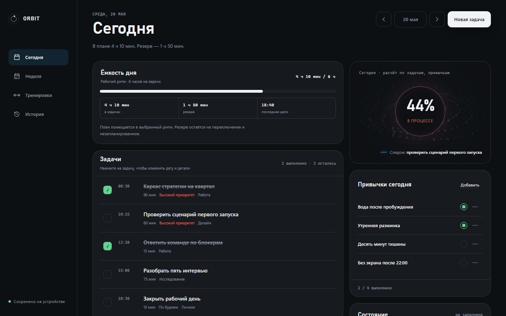
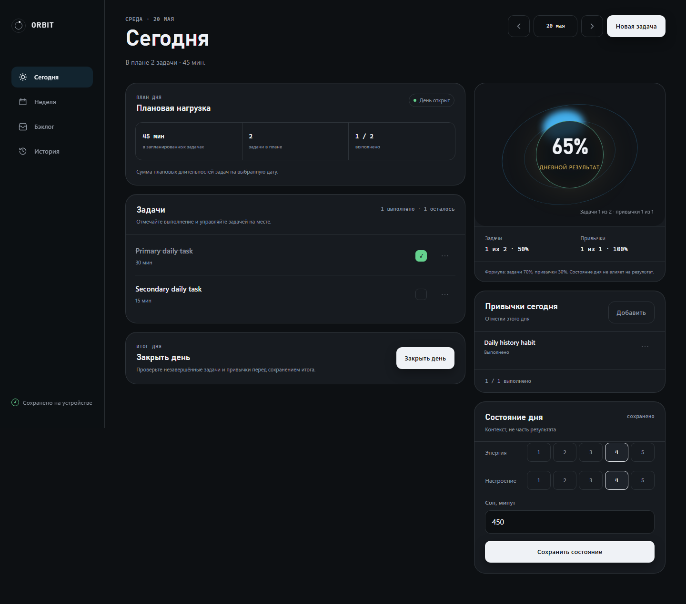
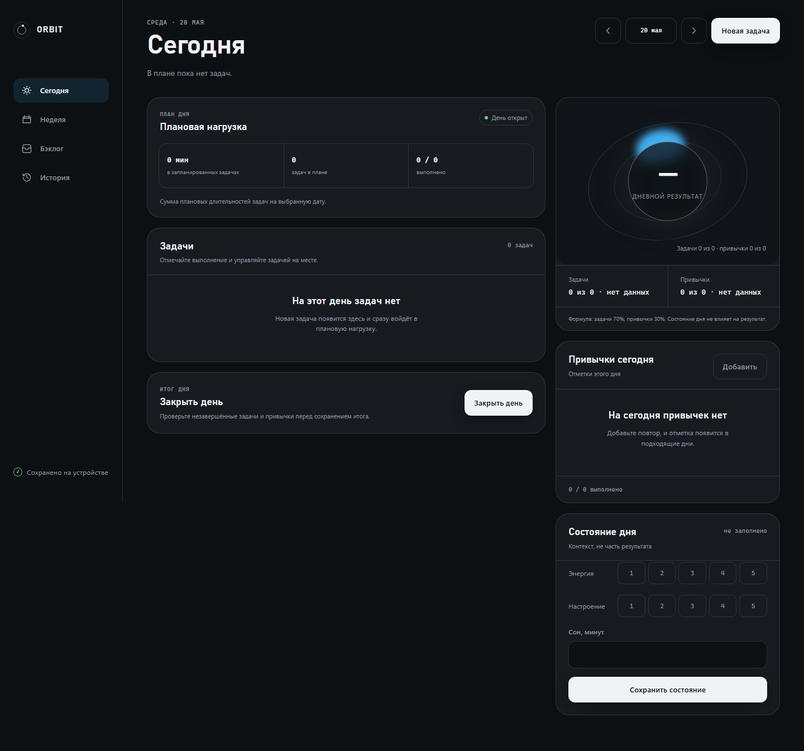
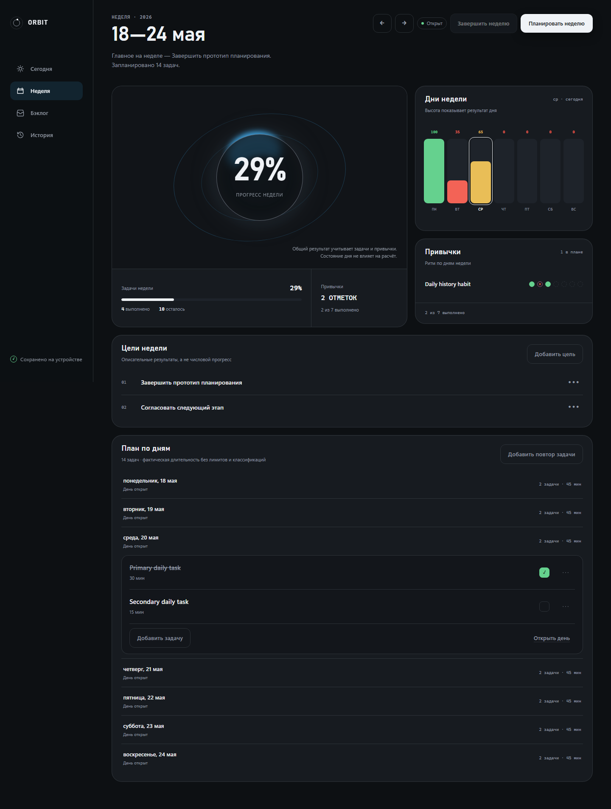
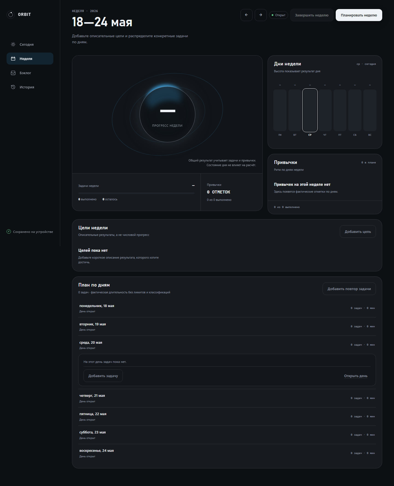
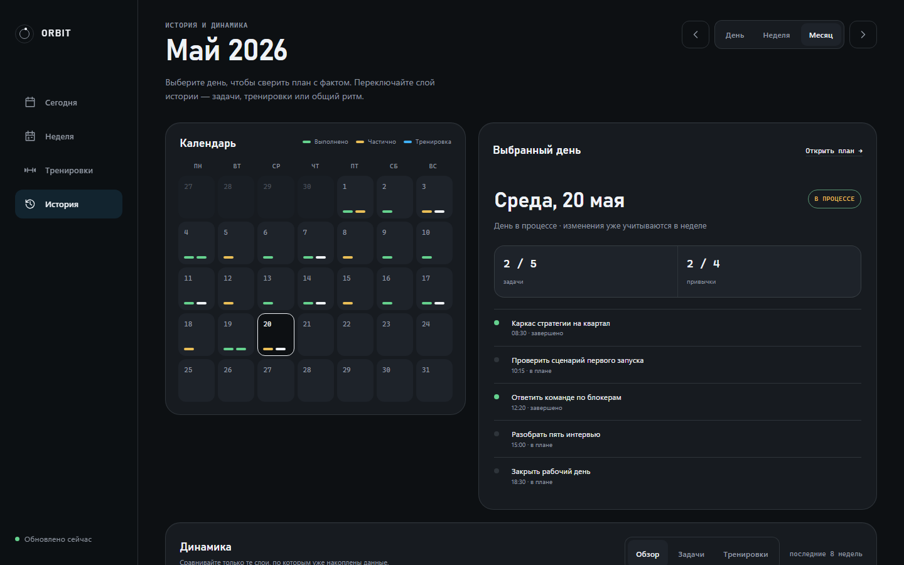
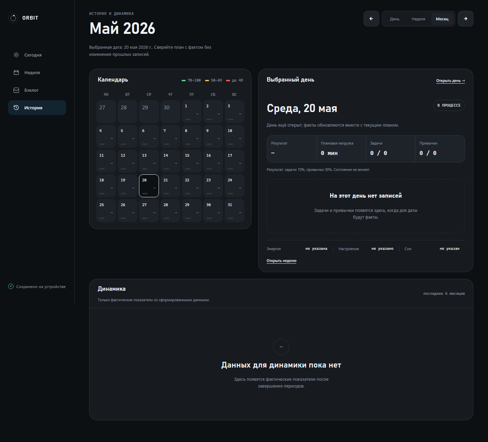

# T105 state-by-state reconciled comparison

## Authority and decision references

The comparison applies repository authority in its approved order: specification
semantics override conflicting prototype behavior; the ORBIT visual system and
non-conflicting Open Design composition remain mandatory.

- **R-VIS / R-D1–R-D5**: the positive visual invariants and numbered remediation
  decisions in
  [`design-reconciliation.md`](../../design-reconciliation.md#positive-visual-invariants-and-remediation-decisions-2026-08-13).
- **C-SHELL**: canonical navigation, breakpoints, and persistence placement in
  [`ui-routes.md` §5](../../contracts/ui-routes.md#5-responsive-shell).
- **C-STATES**: intentional first-use/empty states in
  [`ui-routes.md` §6](../../contracts/ui-routes.md#6-required-page-states).
- **C-HISTORY**: approved History period, calendar, selection, and Dynamics
  semantics in
  [`ui-routes.md` §3](../../contracts/ui-routes.md#3-history-interaction).
- **C-RECON**: the complete semantic override table and positive composition
  requirements in
  [`ui-routes.md` §10](../../contracts/ui-routes.md#10-design-reconciliation).
- **ORBIT**: typography, graphite palette, borders, radii, spacing, controls,
  and orbital gesture in [`DESIGN.md`](../../../../DESIGN.md).

`APPROVED_DEVIATION` below names only a difference explicitly required by those
authorities. It does not mean that a current implementation choice was approved
merely because it exists. “No residual mismatch” means the agent review found no
remaining material `IMPLEMENTATION_DEFECT`, `DESIGN_RECONCILIATION_DEFECT`,
`MISSING_ACCEPTANCE_GATE`, or `UNCERTAIN_REQUIRES_PRODUCT_OWNER` in that retained
state. Automated evidence is summarized in [README.md](README.md); no row claims
manual product-owner visual approval.

## Required-state matrix

| Required state | Frozen reference capture(s) | Retained actual capture | Material comparison | Classification and authority |
|---|---|---|---|---|
| Shared shell | [Daily viewport](../../visual-reference/rendered-1440x900/daily-detail-v2.viewport-1440x900.png), [Week viewport](../../visual-reference/rendered-1440x900/weekly-dashboard-v2.viewport-1440x900.png), [History viewport](../../visual-reference/rendered-1440x900/history.viewport-1440x900.png) | [Desktop shared shell](../../../../e2e/visual/__screenshots__/visual-chromium/desktop-shared-shell.png) | Restores the 220px desktop rail, orbital brand, four-item navigation rhythm, bounded content/gutters, graphite token system, composed page header, restrained controls, and bottom-rail persistence status. Backlog occupies the reference Workouts slot, and normal persistence is a compact device-local status with accessible details rather than a page banner. | `APPROVED_DEVIATION` only: Backlog-for-Workouts (R-D1) and persistence treatment (R-D2), required by C-SHELL. No residual mismatch under R-VIS and ORBIT. |
| Day — populated | [Daily viewport](../../visual-reference/rendered-1440x900/daily-detail-v2.viewport-1440x900.png), [Daily full page](../../visual-reference/rendered-1440x900/daily-detail-v2.full.png) | [Desktop Day populated](../../../../e2e/visual/__screenshots__/visual-chromium/desktop-day-populated.png) | Preserves the asymmetric reference hierarchy: composed date header, prominent planning/load surface, compact task hierarchy, one primary Daily Score orbit with adjacent facts, habits, contextual state, and explicit Close Day. The load card reports only duration/count/completion; the score is specification 70/30 with state excluded; workout content is absent. | `APPROVED_DEVIATION` only: factual load (R-D3), 70/30 scoring/state exclusion, workout omission, and explicit closure behavior (C-RECON). No residual mismatch under R-VIS and ORBIT. |
| Day — empty | [Daily viewport](../../visual-reference/rendered-1440x900/daily-detail-v2.viewport-1440x900.png), [Daily full page](../../visual-reference/rendered-1440x900/daily-detail-v2.full.png), and [frozen ORBIT component source](../../visual-reference/open-design/orbit-design-system.html) | [Desktop Day empty](../../../../e2e/visual/__screenshots__/visual-chromium/desktop-day-empty.png) | Retains the same header, load, score, habit, state, and closure hierarchy while using intentional neutral empty messaging and stable card geometry. There is no separate approved Open Design empty-state image, so this is a spec-required extrapolation from page composition and canonical empty/card grammar, not a claimed pixel match to an absent artifact. | `APPROVED_DEVIATION` only for the same Day semantics and the required first-use/empty adaptation (C-STATES, R-D3, C-RECON). Reference-coverage limitation is explicit; the committed baseline permanently gates the rendered result. No residual mismatch. |
| Week — populated | [Week viewport](../../visual-reference/rendered-1440x900/weekly-dashboard-v2.viewport-1440x900.png), [Week full page](../../visual-reference/rendered-1440x900/weekly-dashboard-v2.full.png) | [Desktop Week populated](../../../../e2e/visual/__screenshots__/visual-chromium/desktop-week-populated.png) | Restores the reference hierarchy: composed week header, dominant neutral Weekly Progress orbit, attached task/habit summary, daily result visualization, habit matrix, visually integrated goals, and compact day planning. Goals are descriptive with contextual CRUD rather than numeric progress; aggregate score is 70/30; workout content is absent. | `APPROVED_DEVIATION` only: descriptive goals (R-D4), 70/30 scoring/state exclusion, and workout omission (C-RECON). No residual mismatch under R-VIS and ORBIT. |
| Week — empty | [Week viewport](../../visual-reference/rendered-1440x900/weekly-dashboard-v2.viewport-1440x900.png), [Week full page](../../visual-reference/rendered-1440x900/weekly-dashboard-v2.full.png), and [frozen ORBIT component source](../../visual-reference/open-design/orbit-design-system.html) | [Desktop Week empty](../../../../e2e/visual/__screenshots__/visual-chromium/desktop-week-empty.png) | Keeps the dominant progress, daily-results, summary, habit, goal, and planner regions in the reference order while rendering deliberate empty/zero-data treatments. No separate Open Design empty-state artifact exists; the comparison uses the populated composition and canonical neutral card/empty grammar. | `APPROVED_DEVIATION` only for descriptive goals, 70/30 semantics, workout omission, and required empty-state adaptation (R-D4, C-STATES, C-RECON). The source limitation is explicit and the retained baseline closes the regression gap. No residual mismatch. |
| History Month — populated | [History viewport](../../visual-reference/rendered-1440x900/history.viewport-1440x900.png), [History full page](../../visual-reference/rendered-1440x900/history.full.png) | [Desktop History Month populated](../../../../e2e/visual/__screenshots__/visual-chromium/desktop-history-month-populated.png) | Preserves integrated period navigation and Day/Week/Month switch, a real aligned month calendar, adjacent selected-day detail, factual rows, and a readable Dynamics card beneath the review region. Dynamics contains only task rate, habit rate, and 70/30 score; no workouts or invented analytics are shown. | `APPROVED_DEVIATION` only: specification-derived period behavior and permitted Dynamics series (R-D5, C-HISTORY), plus workout omission (C-RECON). No residual mismatch under R-VIS and ORBIT. |
| History Month — empty | [History viewport](../../visual-reference/rendered-1440x900/history.viewport-1440x900.png), [History full page](../../visual-reference/rendered-1440x900/history.full.png), and [frozen ORBIT component source](../../visual-reference/open-design/orbit-design-system.html) | [Desktop History Month empty](../../../../e2e/visual/__screenshots__/visual-chromium/desktop-history-month-empty.png) | Retains the period controls, aligned calendar, selected-day panel, and Dynamics hierarchy when no planning facts exist, using factual zero/empty presentation rather than removing structural regions. No distinct Open Design empty-state artifact exists, so this is a canonical-grammar comparison, not fabricated source approval. | `APPROVED_DEVIATION` only for History semantics, permitted Dynamics series, workout omission, and required empty-state adaptation (R-D5, C-HISTORY, C-STATES). The committed baseline is the permanent visual regression target. No residual mismatch. |

## Responsive corroboration

The responsive baselines in [README.md](README.md#responsive-actual-baseline-manifest)
corroborate the same reconciled hierarchy at `820 × 1180` and `390 × 844` for
populated Day, Week, and History Month. Automated geometry additionally requires
the 88px tablet rail, the fixed mobile navigation, one-column priority ordering,
and no horizontal overflow. These captures are corroborating evidence; the
approved desktop Open Design viewport remains the direct reference comparison.

## Embedded comparison plates

The plates below embed the frozen `1440 × 900` reference viewport beside the
full-page application baseline captured from the same `1440 × 900` viewport.
They are the retained human-review comparison artifact; the hash manifest in
[README.md](README.md) identifies the exact bytes.

### Shared shell

| Frozen shared shell in Week reference | Actual shared shell on populated Week |
|---|---|
|  |  |

The shell plate is scoped to the rail, navigation, page bounds, header, and
persistence treatment; differences farther down the Week page are assessed in
the Week plate.

### Day — populated

| Frozen Daily View viewport | Actual populated Day full page |
|---|---|
|  |  |

### Day — empty

| Frozen Daily View viewport used as composition source | Actual empty Day full page |
|---|---|
|  |  |

Open Design supplied no separate empty Daily View. This comparison therefore
checks stable page hierarchy plus canonical ORBIT card/empty grammar and does
not claim approval of a nonexistent source image.

### Week — populated

| Frozen Weekly Dashboard viewport | Actual populated Week full page |
|---|---|
|  |  |

### Week — empty

| Frozen Weekly Dashboard viewport used as composition source | Actual empty Week full page |
|---|---|
|  |  |

Open Design supplied no separate empty Weekly Dashboard. This comparison uses
the populated hierarchy and canonical ORBIT card/empty grammar without
fabricating source approval.

### History Month — populated

| Frozen History viewport | Actual populated History Month full page |
|---|---|
|  |  |

### History Month — empty

| Frozen History viewport used as composition source | Actual empty History Month full page |
|---|---|
|  |  |

Open Design supplied no separate empty History artifact. This comparison uses
the approved History hierarchy and canonical ORBIT card/empty grammar and does
not manufacture a reference state.

## Review conclusion

Across the seven required desktop states, the retained differences from the raw
prototype are fully accounted for by prior authority decisions. The review found
no unapproved material divergence in shared-shell, Day, Week, or History Month
composition. That conclusion is limited to the named captures and automated
geometry/pixel policies; usability validation and product-owner review remain
separate gates.
